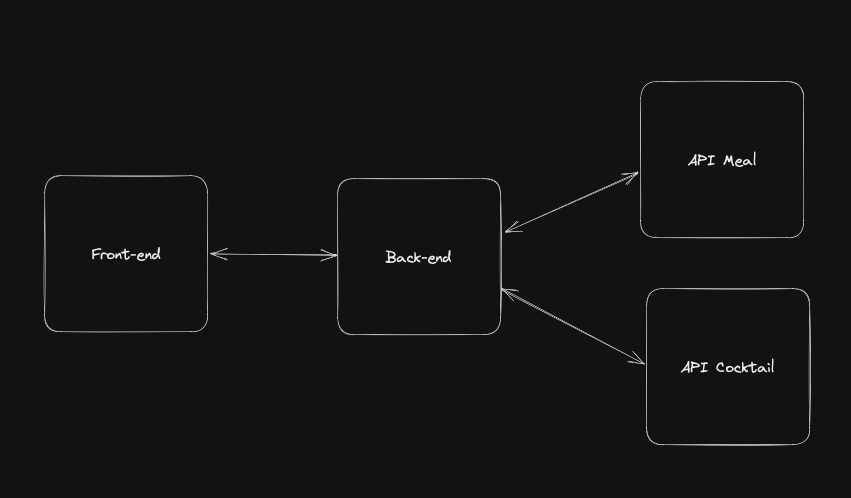

# Boas-vindas ao repositório do Projeto Recipes App Full Stack

Para realizar o projeto, atente-se a cada passo descrito a seguir. Se tiver qualquer dúvida, envie-a por _Slack_! #vqv 🚀

Aqui você encontrará os detalhes de como estruturar o desenvolvimento do seu projeto com base neste repositório, utilizando uma branch específica e um _Pull Request_ (PR) para colocar seus códigos.

## Termos e acordos

Ao iniciar este projeto, você concorda com as diretrizes do Código de Conduta e do Manual da Pessoa Estudante da Trybe.

# Entregáveis

<details id="desenvolvido">
  <summary><strong>👨‍💻 O que deverá ser desenvolvido</strong></summary>

Nesta aplicação, seu grupo será responsável por criar um Back-end e integrá-lo ao front-end do projeto App de Receitas 🍽.

Este projeto não é apenas sobre codar, explorando toda sua habilidade e de seu grupo em _hard skills_, mas também é sobre trabalhar em equipe, realizar discussões, fazer escolhas, estudar novas tecnologias, aprender e se divertir muito!

---

#### App de Receitas versão Back-end

> _Como será que deve ser feito o Back-end daquela aplicação que desenvolvemos no final do módulo de Front-end (nosso querido Recipes App)!?🤔_

Pois é, nosso app de receitas cresceu 🤩!!! Agora precisamos investir nele e prover nossos próprios dados, pois estamos consumindo APIs externas que os detém.

Em aproximadamente três meses, nosso app teve um crescimento exponencial! Isso nos gerou mais receita e também mais problemas 🥲. Hoje em dia, temos alguns gargalos e muito do que queremos, se quisermos algo personalizado, terá um custo mais elevado. Diante disso, decidimos contratar seu time para continuar desenvolvendo a aplicação seguindo as etapas a seguir.

- Nosso app não pode parar, pois tempo é dinheiro!!! Portanto, para iniciar, vamos apenas trazer todas as requisições a APIs de terceiros para dentro da nossa infra! Com isso, nosso Front-end já pode conversar com nosso Back-end sem mudanças bruscas;
  - Para fazer isso, várias discussões precisam ser encaminhadas e decisões precisam ser tomadas pelo seu grupo! Algumas delas podem ser: _Qual arquitetura usaremos? Em Qual linguagem de programação escreveremos nossa API? Quais tecnologias usaremos no Back-end? O que cada pessoa do time fará?_

- Em um segundo momento, precisaremos nos desligar das APIs de terceiros e prover nossos próprios dados! Agora precisamos modelar nosso banco e fazer nossa API ter conhecimento sobre ele.
  - Aqui temos mais um monte de discussões: _Qual tipo de banco de dados usar (relacional ou não relacional)? Qual banco usar (MongoDB, MySQL, Cassandra, PostgreSQL...)?_

- Ao final, precisamos fazer o deploy de nossa API, correto!? Então bora realizar mais essa atividade dentro do nosso processo de criar uma aplicação full stack 🚀

  <br />
</details>

<details>
<summary><strong> ⚓ Estrutura do projeto</strong></summary><br />

O projeto é composto por 4 entidades importantes em sua estrutura:

1️⃣ **Docker**

- O `docker-compose` tem a responsabilidade de unir todos os serviços conteinerizados (Back-end, Front-end e database) e subir o projeto completo com o comando: `docker-compose up -d`;
- Você **deve** iniciar configurando os arquivos `Dockerfile` corretamente, nas raízes do diretório `front-end` e `back-end`.
- Depois, **deve** configurar o arquivo `docker-compose` corretamente, na raiz do projeto, para então inicializar a aplicação.

2️⃣ **Back-end**
 - Será o ambiente em que você realizará a maior parte das implementações exigidas.
 - Deve rodar na porta `3001`, pois o Front-end faz requisições para ele nessa porta por padrão.
 - Sua aplicação deve ser inicializada a partir do arquivo `/backend/src/server.ts`.


3️⃣ **Front-end**
  - O Front-end vocês já fizeram, não é necessário realizar grandes modificações nele. A única exceção será o arquivo Dockerfile que precisará ser configurado e o _fecth_ para a nova URL.
  - O Front-end **deve** se comunicar com o serviço de Back-end pela url `http://localhost:3001`, através dos endpoints que você deve construir nos requisitos.

4️⃣ **Banco de dados**
  - Tem o papel de fornecer dados para o serviço de _backend_.
  - Você **deve** configurar um container docker no arquivo do docker-compose através de um serviço definido como `db`.

  <br />
</details>

<details>
  <summary><strong>🗓 Data de Entrega</strong></summary>

- Este projeto é em grupo;
- Serão `4` dias de projeto;
- Data de entrega para avaliação regular do projeto: `16/10/2023 - 22:00h`.

  </details>
 <br />

# Orientações
## Antes de começar a desenvolver

Leia esta parte atentamente, pois aqui você encontrará informações importantes para preparar corretamente o setup do projeto.

<details>
  <summary><strong> 🔰 Iniciando o projeto</strong></summary><br />

- Clone o repositório `usando link SSH`

- Entre na pasta do repositório que você acabou de clonar;

- Crie uma branch no formato `main-group-x` onde `x` é o número ou nome do grupo;

- **Cada grupo terá uma branch específica** no formato `main-group-X`. Ex: `main-group-1`; `main-group-2`, `main-group-os-tres-mosqueteiros`; etc.;

- **Para entregar o seu projeto, você deverá criar um `Pull Request` base neste repositório no formato `[MAIN GROUP X] [BASE]`**. Seu `Pull Request` deve apontar da branch `main-group-X` para a branch `main`, que será sua PR principal, e deve agregar todo o trabalho do seu grupo para avaliação no final do desenvolvimento;

- **Cada feature/fix/etc... deve ser desenvolvida em uma nova branch**, cujo formato preferencialmente deve ser `main-group-X-<alteração>-<especificação>`. Ex: `main-group-1-feat-login-form`. Isso ajudará tanto o seu time quanto a equipe de instrução a localizar seus trabalhos no projeto;

- **No término do projeto, cada feature/fix/etc... deve ser mergeada _(preferencialmente via PR, com code review e aprovação de todo o grupo)_ com a branch principal do grupo**, na qual ocorrerá a avaliação. Ex: `main-group-1-feat-login-form` deve ser mergeado com `main-group-1`;

- **Cada PR deve, preferencialmente, ter um título no formato `[MAIN GROUP X] [CONTEXTO] [ALTERAÇÃO] [DESCRIÇÃO]`**. Ex: `[MAIN GROUP 1] [API] [FEAT] [LOGIN]`; `[MAIN GROUP 1] [FRONT] [FEAT] [LOGIN-FORM]`; etc. Isso ajudará tanto o seu time quanto a equipe de instrução a localizar seus trabalhos no projeto.

  > Lembre-se de que você pode consultar nosso conteúdo sobre [Git & GitHub](https://app.betrybe.com/learn/course/5e938f69-6e32-43b3-9685-c936530fd326/module/fc998c60-386e-46bc-83ca-4269beb17e17/section/fe827a71-3222-4b4d-a66f-ed98e09961af/day/35e03d5e-6341-4a8c-84d1-b4308b2887ef/lesson/573db55d-f451-455d-bdb5-66545668f436) e nosso [Blog - Git & GitHub](https://blog.betrybe.com/tecnologia/git-e-github/) sempre que precisar!


  <br />
</details>

<details>
  <summary><strong> ⚠️ Configurações mínimas para execução do projeto</strong></summary><br />

Na sua máquina, você deve ter:

- Sistema Operacional Distribuição Unix
- Node versão 16
- Docker
- Docker-compose versão >=1.29.2

➡️ O `node` deve ter versão igual ou superior à `16.14.0 LTS`:

- Para instalar o nvm, [acesse esse link](https://github.com/nvm-sh/nvm#installing-and-updating);
- Rode os comandos abaixo para instalar a versão correta do `node` e usá-la:
  - `nvm install 16.14 --lts`
  - `nvm use 16.14`
  - `nvm alias default 16.14`

➡️ O`docker-compose` deve ter versão igual ou superior à`ˆ1.29.2`:

- Use esse [link de referência para realizar a instalação corretamente no ubuntu](https://app.betrybe.com/learn/course/5e938f69-6e32-43b3-9685-c936530fd326/module/94d0e996-1827-4fbc-bc24-c99fb592925b/section/5987fa2d-0d04-45b2-9d91-1c2ffce09862/day/2f1a5c4d-74b1-488a-8d9b-408682c93724/lesson/b883b81d-21f6-4b60-aa62-8508f6017ea0);
- Acesse o [link da documentação oficial com passos para desinstalar](https://docs.docker.com/compose/install/#uninstallation) caso necessário.

➡️ O grupo deve escolher previamente o Recipe App de alguma pessoa integrante, para, a partir dele, continuar o Back-end.

  <br />
</details>

<details>
  <summary><strong>🐳 Configuração Docker</strong></summary>

⚠️ **Crie os arquivos dockerfile:**

- Os diretórios `frontend/` e `backend/`, devem possuir o arquivo `Dockerfile` configurado corretamente para a aplicação começar a rodar. Sem essa etapa concluída, o _docker-compose_ não funcionará.

⚠️ **Atenção:**

- Seu projeto **deve** conter um arquivo `docker-compose.yml` configurado com os serviços necessários;
- O arquivo `docker-compose.yml` também pode ser utilizado para executar a aplicação na sua máquina local;

  <br />
</details>

# Requisitos

Conforme descrito na seção "[O que deverá ser desenvolvido](#desenvolvido)", o projeto será progressivo observando a seguintes etapas.

1. ✅ Realize o Front-end.
2. 🆕 Traga toda infra e comunicação com Back-end de terceiros para dentro de um Back-end próprio.
3. 🆕 Faça uma pausa para dockerizar nossas aplicações.
4. 🆕 Construa nosso próprio Back-end com nosso banco de dados e prover nossos próprios dados.
5. 🆕 Faça o deploy do Back-end e do banco de dados.

Para iniciar o segundo passo, escolha um Front-end para o grupo e coloque-o dentro diretório do projeto! Isso pode gerar uma discussão inicial e nortear por onde o grupo pode começar.

No passo de "dockerizar", é importante a criação dos arquivos Docker em locais corretos. Na raiz do projeto, deve-se ter um arquivo `docker-compose.yml` e de largada dois serviços (_backend_ e _frontend_). Por fim, dentro de cada diretório, deve-se ter um arquivo `Dockerfile` e este também, deve estar configurado corretamente.

Uma dica final é seguir os passos de criação de forma semelhante ao que foi realizado no TFC (Trybe Futebol Clube). Abaixo há algumas especificações para criação dos requisitos.

```tree
.
├── back-end/
│   ├── src/
│   │   ├── controllers
│   │   ├── routes
│   │   ├── service
│   │   ├── app.js
│   │   └── server.js
│   ├── .dockerignore
│   ├── Dockerfile
│   ├── package-lock.json
│   └── package.json
├── front-end
├── docker-compose.yml
└── README.md
```

## 01 - Primeiros passos para criação de um back-end para o projeto `Recipes App`

A princípio, continuaremos consumindo as APIs. Isso será feito por meio de um Back-end criado pela nossa empresa. Iremos criar uma aplicação Back-end que apenas irá redirecionar as requisições vindo do Front-end para as APIs externas, conforme indica o diagrama a seguir, que traz uma visão geral de como deve ficar nosso Back-end. Dessa forma, nosso primeiro passo estará concluído: teremos um Front-end que se integrará com o nosso Back-end próprio e, assim, controlaremos o que é enviado para nosso Front-end.



Lembre-se de que as APIs externas utilizadas no Front-end foram estas:

- [The Meal DB](https://www.themealdb.com/api.php);
- [The Cocktail DB](https://www.thecocktaildb.com/api.php);

O Back-end deve responder nas seguintes URLs base:

- `http://localhost:3001/meals`
- `http://localhost:3001/drinks`

<details>
  <summary><strong>Observações técnicas</strong></summary>

- Os endpoints de _meals_ e _cocktail_, presentes na documentação da API, devem respeitar os **novos endpoints** descritos na tabela abaixo:

  | Descrição                        | Novo Endpoint no Back-end    | Meals | Cocktail |
  |----------------------------------|------------------------------|-------|----------|
  | Buscar todos os nomes            | /name?q=                     | ✅     | ✅        |
  | Buscar por um nome específico | /name?q=Arrabiata            | ✅     | ✅        |
  | Buscar por primeira letra        | /letter?q=a                  | ✅     | ✅        |
  | Buscar por item aleatório         | /random                      | ✅     | ✅        |
  | Buscar todas as categorias       | /categories                  | ✅     | ✅        |
  | Buscar todas as áreas            | /areas                       | ✅     |  X         |
  | Buscar todos os ingredientes     | /ingredients                 | ✅     | ✅        |
  | Buscar por um ingrediente        | /ingredient?q=chicken_breast | ✅     | ✅        |
  | Buscar por uma categoria          | /category?q=Seafood          | ✅     | ✅        |
  | Buscar por uma área              | /area?q=Canadian             | ✅     |  X         |

  > Esses _endpoints_ são parecidos com os que foram utilizados no projeto _Recipes App_, visto em Front-end. Eles podem ser verificados na documentação das API [The Meal DB](https://www.themealdb.com/api.php) e [The Cocktail DB](https://www.thecocktaildb.com/api.php).

  - O Back-end da aplicação deve estar dentro do diretório chamado `backend`.
  - Arquivos de configuração, como `package.json`, `Dockerfile`, `.dockerignore`, entre outros, devem ficar na raiz do diretório `backend`.
  - Estrutura de diretórios (`controllers`, `services` etc...) e arquivos como `app`, `server`, etc. devem ficar dentro do diretório `src` _(como demonstrado antes deste requisito)_.
  - O Front-end deve ter seu diretório denominado `frontend`.
  - Não há necessidade de alteração do Front-end.
  - Determine com seu grupo a melhor forma de criar os endpoints para reaproveitamento de código.

  <br />
</details>


## 02 - Dockerização das aplicações

Crie e configure os arquivos `Dockerfile` e `docker-compose.yml` conforme indicado a seguir.

- Na raiz dos diretórios `backend` e `frontend` deve ter um arquivo `Dockerfile`.
- A raiz do projeto deve ter um arquivo `docker-compose.yml`.

<details>
  <summary><strong>Observações técnicas</strong></summary>

- O projeto deve possuir dois arquivos `Dockerfile`, um na raiz do diretório `backend` e outro na raiz `frontend`;
- Nesse primeiro momento, o arquivo `docker-compose.yml` deve conter dois serviços: `backend` e `frontend`.
  - `backend` deve expor a porta 3001;
  - `frontend` deve expor a porta 3000;

  <br />
</details>

## 03 - Criando o próprio banco de dados

Agora é hora de deixar sua aplicação com esta cara:


Isso mesmo: seremos donos de tudo e não precisamos mais consumir as APIs externas, pois nosso objetivo é armazenar os dados em um banco de dados mantido pela nossa empresa.

Mas vamos com calma, não precisamos migrar as duas APIs de uma vez. Vamos nos concentrar na diagramação da API de Meals **ou** de Cocktails. Uma vez estando com nossa base de dados criada e populada (manualmente ou via seeders), precisamos refatorar o código para não consumir a API externa.

Para que isso seja possível, crie e configure o banco de dados/arquivos conforme indicado. Para isso:

- crie diagramas e scripts para documentar a aplicação;
- crie o arquivo de conexão com o banco de dados;
- modifique sua aplicação para que ela deixe de consumir a API de terceiros e comece a ler/gravar seus próprios dados;
- crie a base de dados para apenas **uma** API externa.

<details>
  <summary><strong>Observações técnicas</strong></summary>

  Agora é hora de prover nossos próprios dados e criar nosso bancos de dados. Para isso:

- diagrame o banco de dados;
- crie scripts de construção do banco de dados e de população do mesmo;
- crie o banco de dados proprietário da aplicação;
- dockerize seu banco de dados.

  <br />
</details>

## 04 - Faça o deploy do restante da aplicação

Faça o deploy do Back-end e do banco de dados da sua aplicação. Para isso:

- utilize o [Render](https://render.com/) ou outra plataforma que desejar para fazer o deploy;
- faça o deploy do banco de dados;
- utilize o GitHub Actions para facilitar seus deploys.
